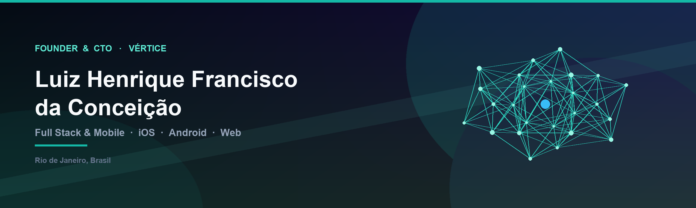

  

  

  
  
  
  

---

## Produtos em produção

Founder e CTO na **Vértice**. Concebo o produto, desenho a arquitetura, publico nas lojas e opero em produção — com foco em sistemas que precisam funcionar quando a internet cai.

  
  
  

| Produto | O que é | Plataformas |
| --- | --- | --- |
| **[PagPegue](https://pagpegue.com.br/)** | PDV/POS para operação de alto fluxo, integração nativa Stone e arquitetura offline-first | Web · Android · iOS |
| **[Condo360](https://www.condo360.app.br/)** | SaaS de condomínio para morador, portaria e síndico (encomendas, visitas, avisos, Pix) | [App Store](https://apps.apple.com/br/app/condo360/id6784867589) · [Play Store](https://play.google.com/store/apps/details?id=app.condo360.br) · Web |
| **[LarZin](https://apps.apple.com/br/app/larzin/id6784781165)** | Organização compartilhada do lar: tarefas, compras, contas, manutenção e agenda | App Store · iOS |

---

## Sobre

- **Founder & CTO** na Vértice — PagPegue, Condo360 e LarZin
- **Analista de Programação** na Usina Itajobi — web e mobile de rastreamento/telemetria em tempo real
- Graduado em **Análise e Desenvolvimento de Sistemas** pela Universidade Estácio de Sá
- Rio de Janeiro, Brasil

O que me diferencia não é listar stack: é diagnosticar o gargalo real (crash, fila, sync, hardware, pagamento) e corrigir na raiz.

---

## Stack

  

  

  

  

  
  
  
  
  
  
  

---

## Stats

  
  

  

  

